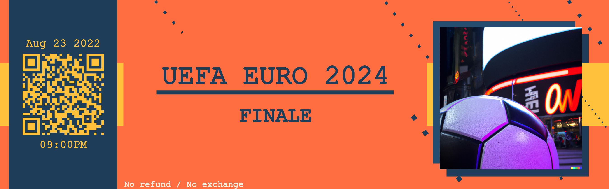

<a id="readme-top"></a>  

# NFT Project

The aim of the project is to create an NFT ticket for various events.

This repo is a student project.

<!-- TABLE OF CONTENTS -->
<details open>
  <summary>Table of Contents</summary>
  <ul>
    <li>
      <a href="#about-the-project">About The Project</a>
      <ul>
        <li><a href="#content">Content</a></li>
      </ul>
    </li>
    <li>
      <a href="#getting-started">Getting Started</a>
      <ul>
        <li><a href="#prerequisites">Prerequisites</a></li>
        <li><a href="#installation">Installation</a></li>
      </ul>
    </li>
    <li><a href="#usage">Usage</a></li>
    <li><a href="#future-features">Future features</a></li>
  </ul>
</details>


<!-- ABOUT THE PROJECT -->
## About The Project

<p align="center" style="width: 100%; display: flex; justify-content: space-between;">
  
</p>

The aim of the project is to create an NFT ticket for various events. The ticket is composed of an image linked to the event the person is going to attend and a QR code with all the information related to the ticket as well as the "time" he bought from the event. People can buy for normal ticket or add an extra to buy a moment from an event. This would allow people to sell their tickets after the event, creating a perpertual revenue.

The aim of these tickets is to prevent black marketing & other problem related to the ticket industry. Since NFTs are unique digital tokens stored on a blockchain. Once created on the blockchain, they can be sold to customers digitally & they are unique. Customers then store NFTs in a secure wallet that they can access on any device.

You can find all of our tickets available on our marketplace [OpenSea](https://testnets.opensea.io/Ticket_Event_NFT)

### Content

Usefull content table :

| Template name | Description |
| ------------- | ----------- |
| [Presentation PPT](./Presentation_PPT/) | Folder with the different project presentations |
| [package folder](./package/) | Packages to generate tickets |
| [My NFT folder](./my-nft/) | Package to transform the generated ticket as NFT |
| [Generated tickets folder](./package/) | Generated tickets |
| [Ressources folder](./ressources/) | Ticket template and pictures used |
| [main.py](./main.py) |  The file used to generate the ticket |


<p align="right">(<a href="#readme-top">back to top</a>)</p>


<!-- GETTING STARTED -->
## Getting Started

### Prerequisites

You need [python 3.9](https://docs.python.org/3.9/), [node v18(.12.1)](https://nodejs.org/en/docs/) and [npm v8(.19.2)](https://docs.npmjs.com/) to run this project

### Installation

_Below are the instructions_

1. Clone the repository :
    ```
    https://github.com/barthh/NFT-project.git
    cd NFT-project
    ```
    
2. Python libraries :
    
    Libraries used are :
    ```requests, qrcode, json, datetime, PIL```
    
    Install them with pip if they are missing : 
    
    ```
    pip install qrcode
    ```
3. JavaScript libraries :
    Libraries used are : ```hardhat```
    
    Install it if it's missing :
    ```
    npm install hardhat
    ```
    
4. External dependencies :<br>
    You need a Mumbai wallet. You can use MetaMask for example.
    
    You need to create a Pinata account where you will store each image and the       JSON related to this image.
    
    Use OPENSEA to check your minted NFT
    
    
    
<!-- USAGE EXAMPLES -->
## Usage

The ticket package allows us to generate a picture and json with data related to it. 

The NFT folder allows to transform the image as an NFT. For that you need to use Pinata to store the image and the json file related to it. You also need to have a Mumbai wallet such as Metamask to store your newly minted NFT.

For the moment, we just save them in a folder but the final goal is to directly take those informations and process them.

<p align="right">(<a href="#readme-top">back to top</a>)</p>

## Future features

It would be necessary to make the link between the generation of an image and the json with an automatic creation of the NFT once everything is done.

Making a website and a database, that would allow to sell the tickets to customers and all the data related to the sell.


<p align="right">(<a href="#readme-top">back to top</a>)</p>

## Ideas

To automate the whole, it will be necessary to create a database that allows to create events, to manage the number of places, the price, to have the possibility to have its own images to add to the ticket.

<p align="right">(<a href="#readme-top">back to top</a>)</p>
